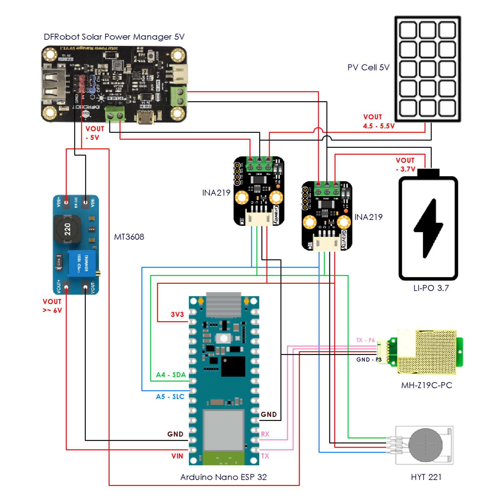

# Indoor Air Quality Monitoring And Prediction
An indoor air quality monitoring- and prediction project for self-study purposes.

**Table of Content**
- [Motivation](#motivation)
- [Technology Stack](#technology-stack)
- [Solution Design](#solution-design)
  - [Vision Statement](#vision-statement)
  - [Project Goals](#1-project-goals)
  - [Requirements](#2-requirements)
  - [System Components](#3-system-components)
- [Project Roadmap](#project-roadmap)
- [Project Status](#project-status)
- [System Design](#system-design)
  - [Sensor Module](#sensor-module)
    - [Sensor Module Wiring Schema](#sensor-module-wiring-schema)
  - [Infrastructure System Diagram](#infrastructure-system-diagram)
- [Directory Structure - Sensor Module](#directory-structure-sensor-module)
- [Directory Structure - Cloud-Infrastructure](#directory-structure-cloud-infrastructure)
- [Costs](#costs)
- [Setup for Development](#setup-for-development)
  - [Linux Subsystem (WSL)](#linux-subsystem-wsl)
    - [Install Debian WSL](#install-debian-wsl)
    - [Setup Debian WSL](#setup-debian-wsl)
    - [Create Python Virtual Environment](#create-python-virtual-environment)
    - [Install Node](#install-node)
  - [Daily Command for Local Dev](#daily-command-for-local-dev)
- [CI/CD Pipeline](#cicd-pipeline)
- [Project Documentation](#project-documentation)
- [Version Control](#version-control)
  - [Link GitHub to WSL](#link-github-to-wsl)
  - [Commit naming rules](#commit-naming-rules)
- [Backlog](#backlog)


## Motivation
This is an end-to-end air quality monitoring and prediction project. A sensor module is installed in an appartment room, which collects and periodically sends measurement data to a server. The server processes the data and provides a web interface for real-time monitoring and prediction of indoor air quality.

The goal of this project is to learn and apply MLOps best practices to a fearly simple use-case. The following topics are aimed to be covered:

| | Key Aspects |
|-|-|
| **Dev & Ops** | • Version Control & CI/CD<br>• Code Quality & Testing<br>• Infrastructure Automation<br>• Container Orchestration<br>• Security & Monitoring |
| **Data Pipeline** | • Ingestion & Validation<br>• Feature Engineering<br>• Data Versioning<br>• Feature Store Integration |
| **ML Lifecycle** | • Training & Experimentation<br>• Model Registry & Versioning<br>• Deployment & Serving<br>• Performance Monitoring<br>
| **Data Communication** | • Visualisation<br>• Interactive Dashboarding
<br><br>

## ```Technology Stack```

| Component | Tools & Technologies |
|-|-|
| **Development** | • Git - Version Control<br>• GitHub Actions - CI/CD<br>• pre-commit - Code Quality |
| **Data** | • Data Version Control<br>|
| **ML & Deploy** | • Docker|
| **Infrastructure** | • AWS - Cloud Platform<br>• Terraform - IaC<br>|

## Solution Design

### ``` Vision Statement```
Create an indoor-air monitoring system that helps users maintain optimal air quality levels through real-time monitoring, predictive analytics and event detection.

### ``` 1. Project Goals```
- Monitor and predict indoor CO2, humidity, temperature
- Provide real-time insights through visualizations
- Enable air quality prediction and alerts

#### Core Features
1. **Real-Time Monitoring**
   - Live CO2, humidity and temperature measurements
   - Alert management system

2. **Predictive Analytics**
   - 24-hour forecasts for CO2, humidity and temperature
   - Multiple prediction model:
     - Time Series
     - Polynomial Regression
     - DNN
     - DNN with enriched Data
   - Models comparison & benchmarking
   - Automated model retraining
   - Model performance monitoring

3. **Data Management**
   - Automated data collection
   - Data quality monitoring
   - Data versioning
   - Data storage and retrieval
   - Data pipeline for real-time data processing
   - Data validation and feature engineering
   - Data enrichment with external sources (e.g., weather data)

4. **User Interface**
   - Web-based dashboard
   - Interactive dashboards
   - User authentication and access control


### ``` 2. Requirements```

| Requirements Type | Description | Specifications |
|-|-|-|
| **Functional** | Real-time monitoring | • Sensor data collection every 60s<br>• Live dashboard<br>• Historical data view |
| | Predictions | • 24h forecasting window<br>• Model benchmarking|
| | Alerts | • Threshold configuration<br>• Email/SMS notifications<br>• Alert history |
| **Non-Functional** | Performance | • Data latency < 1s<br>• API response < 500ms<br>• 95% uptime |
| | Scalability | • Multi-sensor<br>• Multi-model<br>|
| | Security | • Encrypted transmission<br>• Access control<br>• Secure API endpoints |


### ``` 3. System Components```
| Component | Description | Key Features |
|-|-|-|
| **Sensor Module** | Data collection unit | • CO2/humidity sensors<br>• Batch API<br>• Secure transmission <br>• 72h backend-server independency |
| **Backend Server** | Computation backend | • Handles communication to sensor module<br>• Orchestrates **Data Pipeline**, **ML System** and **Web Interface**<br>|
| **Data Pipeline** | Data processing system | • Real-time ingestion<br>• Data validation<br>• Feature engineering |
| **ML System** | Prediction engine | • Model training<br>• Automated retraining|
| **Web Interface** | User dashboard | • Live monitoring<br>• Predictions view<br>• Alert management |


<br>

## Project Roadmap
### ``` **MVP**```
A web page with CO2, temperature and humidity TS dashboard with the following componenets:
<br>

| Sensor module| Backend | Frontend |
|-|-|-|
| • Sensors<br>• PV & Battery<br>• MC<br>• MC Logic | • Data Pipeline <br>• Database <br>• Frontend Host | • Webpage (static)<br>• Login <br>• Dashboard (static)


- The **Sensor Module** is assembled and runned by software that collects and sends data to the backend.<br>
- The **Backend** hosts and serves the frontend. The backend receives and stores data from the sensor module.<br>
- The **Frontend** is a static webpage with login. A dashboard is loaded with the most recent data on the database.

**Data Pipeline:**<br>
- Workflow: Data Collection -> Data Quality Gate -> Data Storage<br>
- Infrastructure: API Gateway (Data Collection) -> Lambda Function (Data Quality Gate) -> S3 Bucket (Data Storage)

**Frontend:**<br>
Landing page with login and dashboard. The dashboard is a static webpage that displays the most recent data from the database.

**MC Logic:**
- Credentials management for WiFi and API
- WiFi connection
- Data collection and transmission
<br><br>

### ``` 1st Feature Implementation```
- Add first model to dashboard
   - Model 1: Time Series

### ``` 2nd Feature Implementation```
- Add battery charge status monitoring
- Add PV Power monitoring
- Make Dashboard interactive

### ``` 3rd Feature Implementation```
- Add two additional models
   - Model 2: Polynomial Regression
   - Model 3: DNN
- Add model benchmarking
- Build sensor module chassis

### ``` 4th Feature Implementation```
- Add model with meteo data enrichment
   . Model 4: DNN with enriched data
- Add battery charging prediction

### ``` Backlog```
- Add automated model retraining
- Add brightness sensor
- Add brightness monitoring
- Make Dashboard Dynamic (Live)
- Add alert management

<br>

## Project Status

05.05.2025 - The sensor module successfully sends data to the S3. The data is validated by the Lambda function in prior via an JSON Schema.
<br>
<br>
To improve:
- There are occasional uplaod errors, where the connection to the API endpoint is rejected. The error might be due to the http client instaciation as well as a general lack of upload logic reduncancy.
- The sensor module is not power autark. A battery with higher capacity as well as larger PV panel is needed. Also, the CO2 sensor is yet not implemented and might require a higher current supply than the actual setup can provide.

## System Design

### ``` Sensor Module```
The sensor module is composed of the following components:

| Function | Module | Links
|-|-|-|
| MC Dev Board | Arduino Nano ESP32 | https://docs.arduino.cc/tutorials/nano-esp32/cheat-sheet/ |
| Humidity Sensor | HYT 221 | |
| CO2 Sensor | MH-Z19C-PC | |
| Power MGMT | DFRobot Solar Power Manager 5V | |
| V/I Monitor | INA219 | https://wiki.dfrobot.com/Gravity:%20I2C%20Digital%20Wattmeter%20SKU:%20SEN0291 |
| V Step-Up | MT3608 | |
| Solar Power | PV Panel 4.5-6V, max 1A | |
| Battery | Li-Po 3.7V | |

#### Sensor Module Wiring Schema

<div align="center">

</div>

<br>


### Infrastructure System Diagram
Following the Cloud ressource system diagram  - [Generate System Diagram](#generate-system-diagram):

## Directory Structure - Sensor Module
The following directory is uploaded on the ESP32. The first two folder levels are removed before upload.
```plaintext
micropython
├── libs
|   ├── __init__.py
|   └── ...                # Any libs not included in MicroPython
└── logic
    ├── data_collection    # Data collection logic
    |   ├── adapter
    |   |   ├── __init__.py
    |   |   ├── hyt221.py
    |   |   ├── ina219.py
    |   |   └── mhz19cpc.py
    |   ├── port
    |   |   ├── __init__.py
    |   |   └── sensorport.py
    |   └── __init__.py
    ├── data_transmission  # Data transmission logic
    |   ├── adapter
    |   |   ├── __init__.py
    |   |   ├── api_contract_adapter.py
    |   |   └── http_adapter.py
    |   ├── port
    |   |   ├── __init__.py
    |   |   ├── api_contract_port.py
    |   |   └── transmissionport.py
    |   ├── service
    |   |   ├── __init__.py
    |   |   ├── api_http_service.py
    |   └── __init__.py
    ├── modules            # Various scripts
    |   ├── __init__.py
    |   ├── memory_manager.py
    |   ├── mock_abc.py
    |   ├── secure_storage.py
    |   └── wifi.py
    ├── __init__.py
    └── main.py

```


## Directory Structure - Cloud-Infrastructure
```plaintext
app
|
├──
```

### ```Costs```
The operational costs of the infrastructure are about 30 cents per day for the private VPC endpoint. The rest remains within the AWS free tier.

Cost traps:
- Avoid public IP
- Avoid NAT
- Avoid multiple subnets for VPC

<br>

## Setup for Development
In order to run the CI/CD pipeline, you need to make sure to:
- Run VS as admin.
- Install Debian on WSL
- Setup Git on WSL - see [Version Control](#version-control)

### ``` Linux Subsystem (WSL)```
If you are working with Windows, you need to use a Linux subsystem to work in the same env as the CI/CD pipline. Run VS as admin!

#### Install Debian WSL:
```bash
# 1. In Powershell
wsl --set-default-version 2
```
```bash
# 2. Install Debian (or Ubuntu)
wsl --install -d Debian
# 3. Follow the installation instruction (Restart).
```
#### Setup Debian WSL:
```bash
# 1. In WSL - Install Python (Check latest version for Debian)
sudo apt install -y python3.11  # Install Python
sudo apt install -y python3-pip  # Install Python package manager
# 3. Follow the installation instruction.
```

#### Create Python Virtual Environment
```bash
# Install proper venv lib for linux
sudo apt install python3.11-venv

# Create new virtual environment
python3 -m venv .venv

# Activate virtual environment
source .venv/bin/activate
```

#### Install Node
```bash
# Install Node.js and npm
sudo apt update
sudo apt install nodejs npm
```

### ``` Daily Command for Local Dev```
```bash
# Activate Python virtual environment
source .venv/bin/activate

# Set AWS profile for TF deployment
# unset AWS_PROFILE
# aws sts get-caller-identity
# aws sso login

export AWS_PROFILE="profile.name"
export AWS_REGION="eu-central-1"
export AWS_URL="url"

# Install Python packages
pip install -r requirements.txt
pip install -r requirements-dev.txt

# Install pre-Commits
pre-commit install
```
<br>

## CI/CD Pipeline

- In Makefiles, each line runs in a separate shell

Linters: ruff, tflint, yamllint, shellcheck
Formatters: terraform_fmt, ruff-format
Security scanners: tfsec, checkov
Other checks: end-of-file-fixer, trailing-whitespace
<br>

## Project Documentation
The project is documented by means of a wiki and README's.

### ``` README```
Every main folder should have a README, describing its substructure, included tech and used knowledge.

### ``` Wiki - Sphinx```
Sphix is used to automatically generate a code docstring documentation as well as dedicated pages in marksdown.
<br>

## Version Control
A guideline for version control in this project. Work on main. Use Flags. Do not break the Pipeline.

Git doc: https://git-scm.com/book/en/v2/Getting-Started-First-Time-Git-Setup
### ```Link GitHub to WSL```

```bash
# 1. Update package manager
sudo apt-get update
# 2. Install git
sudo apt-get -y install git

# 3. Create directory for SSH agent
mkdir -p ~/.ssh
# 4. Generate SSH-Key pair
# - Press ENTER to choose default file location
# - Press ENTER for no passphrase
ssh-keygen -t rsa -b 4096 -C "your.email@example.com"

# 4. Start the SSH agent
eval "$(ssh-agent -s)"
# 5. Add your new identity key to SSH agent
ssh-add ~/.ssh/id_rsa

# 5. Display and copy your public key
cat ~/.ssh/id_rsa.pub
```
5. Add to GitHub:

- Go to GitHub → Profile "Settings" → SSH and GPG keys
- Click "New SSH key"
- Paste your key and save
```bash
# 6. Configure Git globally
# Name and email do not need to be realated to GitHub Account
git config --global user.name "Any Name"
git config --global user.email "your.email@example.com"

# 7. Test connection
ssh -T git@github.com
```
```bash
# 8. Check URL's
# If the URL starts with https://, you need to change it in order to use SSH.
git remote -v

# 8. Set remote URL for SSH
# Use SSH URL
git remote set-url origin git@github.com:<username>/<repository>.git

```
<br>

### ```Commit naming rules```

| Type | Purpose | Examples |
|------|---------|----------|
| `feat` | Change source code | New features, code changes |
| `ci` | CI configuration | CI Pipeline, GitHub Actions updates |
| `test` | Test-related changes | Adding/updating test cases |
| `perf` | Performance improvements | Optimization |
| `build` | Build system or dependency changes | Build scripts, dependency updates |
| `chore` | Routine maintenance tasks | Version updates, file renaming |
| `refactor` | Non-feature code changes | Code reorganization, readability |
| `style` | Code formatting changes | Whitespace, semicolons |
| `docs` | Documentation updates | README changes, code comments |
<br>

# Backlog
- Explore UV for Python (Benefit could be faster setup on Runners)
